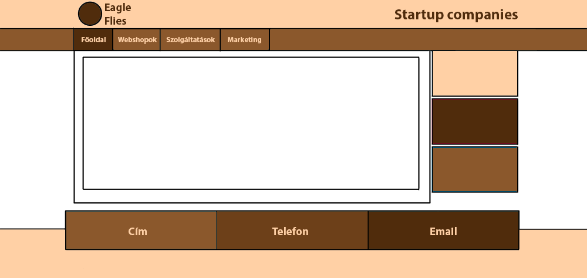
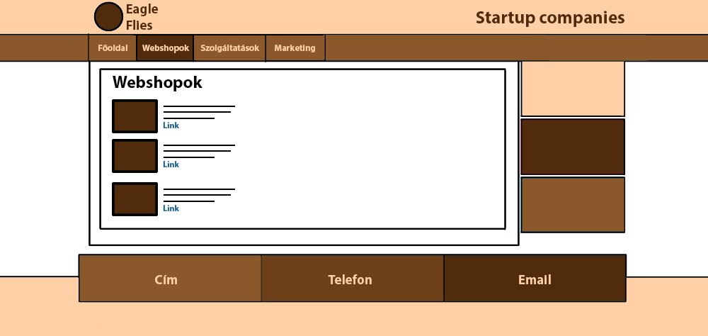
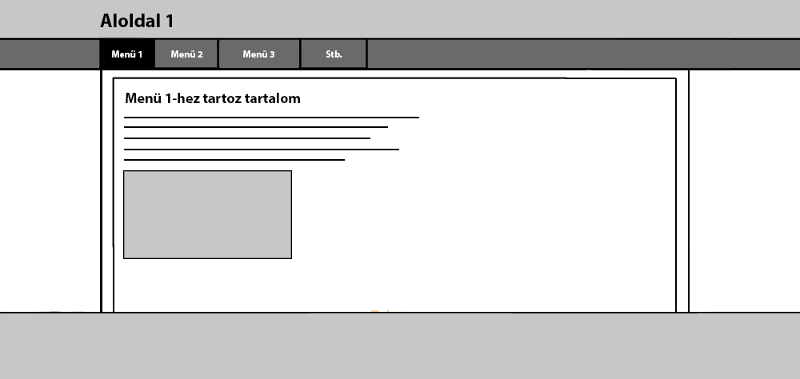

# Funkcionális specifikáció

## 02. Jelenlegi helyzet
Megkeresést kaptunk, egy gyűtő weboldal megvalósítására amelynek célja, hogy az itthoni, Magyarországi startup vállakozások megjelenítése. Ezzel segítve a munkájukat a nagyközösség elérésevel azoknak akik nem rendelkeznek - vagy nem megfelelő - média csapattal. Napjainkban egyébként is nagy szerepet játszik az online médiában történő megjelenés, mondhatni amelyik cég nincs fent az interneten az nem is működik teljes erővel (bár ez erős túlzással azért). Mindazonáltal még mindig napjain része a COVID-19, az emberek amúgy is a számítógép és a telefon előtt töltött ideje mégjobban megnőtt a vírusra és bezártságra való tekintettel, emiatt még inkább érdemes minnél több helyen megjelenni az interneten a vállakozások számára. A gyűjtői oldalon akár saját weboldallal is megjelenhetnek a vállalkozások, ám ha nincs még nekik vagy nem készült el valamilyen oknál fogva, akkor sem kell csüggedni, a fejlesztőink igénybe vehetőek webfejlesztési munkálatokra vagy annak besegítésére. A menüben megjelenő menüpontok felosztják és különböző kategóriákba rendezik a cégeket, ezáltal bárki aki a fő honlapon jár könnyen átlátja és megtalálja az általa keresett dolgokat, valamint ezzel a kategorizálással segítjük, hogy a vállalkozások csak a számukra releváns részben jelenjenek meg.

## 05. Követelménylista
| Modul       | ID      | Név                     | Verzió | Kifejtés                                 |
|-------------|---------|-------------------------|--------|------------------------------------------|
| Felület     | F#0101  | Főoldal                 | 1.0    | A főoldal felülete jelenik meg először, itt találhatók az általános információk és innen navigálható tovább a különböző menüpontokra. |
| Felület     | F#0201  | Webshopok menüpont      | 1.0    | Csak a webshopok megjelenítése           |
| Felület     | F#0202  | Szolgáltatások menüpont | 1.0    | Csak azok a cégek megjelenítése akik szolgáltatással rendelkeznek. |
| Felület     | F#0203  | Marketing               | 1.0    |                                          |
| Jogosultság | J#01    | Regisztrálás            | 1.0    | A felhasználók tudnak új fiókot létrehozni a megadott rendszerekbe a funkciók eléréséhez. |
| Jogosultság | J#02    | Bejelentkezés           | 1.0    | Az oldalt látógató felhasználók be tudnak jelentkezni az adott rendszerbe, hogy elérjék a további funkciókat. |
| Jogosultság | J#03    | Kijelentkezés           | 1.0    | A bejelentkezett felhasználó kiléptetése a rendszerből. |
| Jogosultság | J#04    | Jelszó cseréje          | 1.0    | Elfelejtett jelszó vagy csak biztonsági okokból történő jelszó cseréje. |
| Vásárlás    | V#001  | Termékek                 | 1.0    | A webshopokban megjelenő termékek megjelenítése részletes leírással.         |
| Vásárlás    | V#002  | Kosár                    | 1.0    | Webshopokban bejelentkezés után a kosár tartalmának elérése, szerkesztése           |
| Vásárlás    | V#003  | Rendelés                 | 1.0    | Rendelés leadása a webshopokban. |

## 06. Megfeleltetés - traceability
|01|Főoldal: megvalósítás napirendre téve.|Elérhetőségek, beágyazott Google maps térkép, üzenet a fejlesztőknek| Információk
|02|Webshopok menüpont: megvalósítás napirendre téve.|Itt található meg az összes, webshop kategóriába sorolható oldal. Később ezen belül több kategória lesz kialakítva és kereshető is lesz, ha elég sok weboldal lesz.|
|03|Szolgáltatások menüpont: megvalósítás napirendre téve.|Olyan vállalkozások weboldalai, melyek valamilyen online elérhető ingyenes vagy díjköteles szolgáltatást nyújtanak. Ezek később szintén több kisebb kategóriába lesznek rendezve és kereshetőek lesznek, ha elég sok lesz belőlük.|
|04|Marketing menüpont: megvalósítás napirendre téve.|Azoknak a startup vállalkozásoknak a weboldalai tartoznak ide, melyek az előbbi két kategória közül bármelyikbe vagy egyikbe sem sorolhatók be. Később ezek is kereshetőek lesznek és több kategóriára oszlanak majd.|
|05|Reszponzivitás: megvalósítás napirendre téve.|Alapkövetelmény a gyűjtőoldallal és a weboldalakkal szemben is, hogy minden kijelzőméreten megjelenthető legyen a tartalom.|
|06|Edzséssel kapcsolatos webshop: regisztráció, bejelentkezés: megvalósítás napirendre téve.|A webshopot regisztrált felhasználók használhatják.|
|07|Edzsés webshop: termékek rendelése: megvalósítás napirendre téve.|Webshop, melyen keresztül a felhasználók edzőtermi kellékeket, étrendkiegészítőket, vitaminokat stb rendelhetnek.|
|08|Edzés webshop: felugró ablak chat funkció: megvalósítás napirendre téve.|A vevőszolgálatnak egy felugró chat ablakban lehet üzenetet küldeni, melyre az ügyeletes admin lehetőleg perceken belül reagál.|
|09|Ingatlanos oldal: ingatlan-értékbecslés igénylése: megvalósítás napirendre téve.|A felhasználó lakásról vagy családi házról kérhet ingatlan-értékbecslést és/ vagy energetikaitanúsítványt|
|10|Ingatlanos oldal: vagyonszerzési illeték meghatározása: megvalósítás napirendre téve.|A szükséges adatok megadása után a felhasználó megkapja az ingatlanjához tartozó vagyonszerzési illeték pontos összegét|
|11|Ingatlanos oldal: személyi jövedelemadó meghatározása: megvalósítás napirendre téve.|A szükséges adatok megadása után a felhasználó megkapja az ingatlanjához tartozó személyi jövedelemadó pontos összegét|
|12|Mozi oldal: elérhető filmlista a következő filmekről: megvalósítás napirendre téve.|a felhasználó felsorolva lássa a következő filmeket
|13|Mozi oldal: elérhető foglalóhelyek: megvalósítás napirendre téve.|a felhasználó grafikusan láthassa az elérhető helyeket, és legyen lehetősége online foglalni, majd nyomon követni a helyeit
|14|Mozi oldal: online fizetés: megvalósítás napirendre téve.|online fizetés biztosítása a felhasználónak

## 07. Jelenlegi üzleti folyamatok modellje
A jelenlegi járványidőszakban a vállalkozások jelentős része rendkívül nehéz helyzetbe került. A személyes kommunikáció szinte teljesen lehetetlenné vált, az üzlethelyiségek, irodák jelentős része bezárt vagy a forgalmuk nagy mértékben visszaesett. A cégek arra kényszerülnek egyre inkább, hogy az interneten keresztül tegyék elérhetővé termékeiket és szolgáltatásaikat.  
Ehhez azonban arra van szükség, hogy az emberek elérjék, megtalálják őket, ehhez pedig egy közös gyűjtőoldlara van szükség, ahonnan könnyen elérhetővé válnak. Ezek nem csupán linkeket biztosítanak ezekre a helyekre, hanem a fejlesztőik maguk készítik el a weboldalakat a megrendelők számára ennek a gyűjtőoldalnak a részeként.  
A jelenleg ismert ilyen jellegű weboldalak azonban megkövetelik, hogy a rajtuk megjelenő oldalak stílusa és felépítése egységes, sablonos legyen, milyen funkciókat lehet vagy nem lehet megvalósítani. A céljuk az, hogy a megrendelők alkalmazkodjanak hozzájuk, nem pedig az, hogy a megrendelők megvalósíthassák elképzeléseiket. A célunk az, hogy ez a jelenlegi helyzet az ellenkezőjére változzon.

## 09. Használati esetek

Két felhasználói szerepkör atrtozik az oldalhoz: user és admin. Az adminok kezelik a weboldalat, javítják a fejlesztési hibákat, felülvizsgálják az adott aloldalak működését. A weboldalnak 4 darab főadminja lesz (fejlesztő), újabb admint csak meglévő user státuszának módosításával lehet felvenni. Az újonnan regisztráltak csak user státuszúak lehetnek, kivéve ha jogosultságot kapnak az oldal fejlesztőitől.
Az alap felhasználók is elérik a weboldal kulcsfunkcióit, esetleges kínálatszintű felhasználók (pl. eladók) hozzáadása lehetséges az adminisztrátor által.

## 10. Képernyőtervek
Weboldalunk egy gyűjtőoldal, mely menükbe rendezve, katogorizálva szolgáltat startup cégeknek egy közös platformot, ahonnan elérhetőek a weboldalaik, melyeket szintén mi fejlesztünk a megrendelők számára. Azonban ezek megjelenése, felépítése, nagysága és funkciói teljesen eltérőek is lehetnek, nem kell követniük semmilyen szabályt. A gyűjtőoldal megjelenése és felépítése egyszerű, stílusa és logója a vadnyugati időket idézi, neve az indián Eagle Flies, mely kifejezi a weboldal küldetését, mely nem más, mint kezdő kisvállalkozások segítése a felemelkedésben. Az alábbi képernyőterven ennek az oldalnak a vázlata látható. A főoldalon majd az információk és elérhetőségek találhatóak meg.  
  
Az oldal kezdetben kevés menüponttal indul, melyek száma később bővülni fog, ha majd egyre több megrendelő weboldalát készítjük el és kategorizáljuk, a menüpontokon belül ezeket szintén kisebb csoportokba fogjuk sorolni és kereshetővé tesszük. Az egyes menüpontok alatt rövid leírással, képpel érhetőek el a weboldalakra vezető linkek.  
  
Az elkészített oldalak stílusa a weboldalunktól és egymástól is teljesen független, a megrendelők maguk dönthetnek róla. Nemcsak a színekről, hanem a menü, a tartalom elrendezéséről is. Egyszerű navigációs szabályok betartása mellett a fejlesztők szabadon elkészíthetik a megrendelőnek leginkább megfelelő oldalt. A képernyőterv is azért szürke színű és általános, mert ezt a szabadságot fejezi ki.  

## 11. Forgatókönyvek
A weboldal kezdőlapjának meglátogatásakor az Eagle Flies oldala jelenik meg. A menüsávban külön kategórát választhat pl. Szolgáltatások, az ahoz tartozó promótált oldalok jelennek meg, kerülnek kilistázásra a hozzá tartozó tartalommal. A pársoros tömör leírás olvasása után a felhasználó el tudja dönteni meg szeretné-e látogatni az adott vállalkozás weblapját. Akármelyik oldalra megyünk tovább innentől fogva egyedi sítlusokkal fogunk találkozni, hiszen minden cég szeretné saját magát saját arculatával reklámozni. Az általunk megjelenített vállalkozások mind ellenőrzöttek, ezáltal bármilyen webshop, szolgáltatás és egyebet biztosan megtekinthetik a felhasználók anélkül, hogy csalás áldozatává válnának.
 
Egy online bolt látogatása esetén amelyet a webshopok menüből bármely tetszőleges oldalra tovább lépve tudunk válogatni az ő általuk kínált termékekből. A weboldalak ellenőrzés után kerülnek ki, ámbár ha bármiféle minőségi problémát észlel a felhasználó azt tudja jelezni felénk a kapcsolattartói elérhetőségek közt talált információk közül egyikével és mi utána nézünk. Viszont ha számára mindent rendben talál és esetlegesen egy jó termékre is rá bukkan azt regisztrációval vagy anélkül (ezt oldala válogatja) meg tudja rendelni attól a vállalkozástól.
 

## 12. Fogalomszótár
A reszponzív weboldal: A reszponzív weboldal (RWD) egy olyan megközelítéssel tervezett weboldal, amelynek a célja az, hogy optimális megjelenést biztosítson - könnyű olvashatóság, egyszerű navigáció a lehető legkevesebb átméretezéssel és görgetéssel - a legkülönfélébb eszközökön (az asztali számítógép monitorjától egészen a mobiltelefonokig). Progressive enhancement: A lényeg az, hogy a szöveges vagy képi tartalmi részekből minden látogató ugyanazt kapja, de mindenkinek úgy tálaljuk azt, ahogy azt a körülmények megengedik. Nevezhetnénk Content First szemléletnek is, mert lényegében arról van szó, hogy minden más weboldalelem a tartalomnak van alárendelve. Ez fontos, hiszen a weboldalak elsősorban információátadás céljából készülnek. A látványos részek háttérbe szorulnak, illetve csak akkor kerülnek képbe, ha az adott eszköz, illetve elérhető internetsebesség mellett a tartalom prezentálása zökkenőmentes.
Adminisztrátor: teljes jogú felhasználó, az adott aloldal fejlesztője