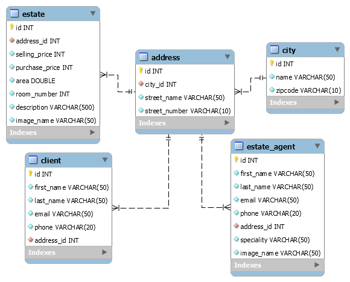

# Rendszerterv

## 01. A rendszer célja

### Amit ez a dokumentum tartalmaz:
A rendszerterv célja, hogy leírja milyen rendszert szeretnénk létrehozni, ennek mi is a célja, hogyan, milyen technológiák használatával, milyen időbeosztással rendelkezik a projekt, milyen erőforrások szükségesek az alkalmazáshoz.

### A projekt áttekintése:
Célünk egy olyan weboldal létrehozása mellyel támogatni tudjuk reklámozással esetleges saját vagy külsős itthoni startupokat weboldalaik megjelenítésével.

## 02. Projektterv
**Rendelkezésre álló szoftvererőforrások:**
- Windows 10 operációs rendszer
- WAMP szerver
- Sublime Text 3 IDE
- MySQL localhost szerver  
**Rendelkezésre álló hardvererőforrások:**
- Fejenként legalább egy IBM PC 8 vagy 16 GB RAM-mal, 1 TB SSD vagy HDD tárhellyel, i5-ös vagy i7-es processzorral  
**Rendelkezésre álló idő, ütemterv:**
- Funkcionális és követelményspecifikáció: 1. hét
- Rendszerterv: 2. hét
- Alapprojekt kialakítása és szükséges anyagok (szövegek, képek) összegyűjtése, adatbázisok létrehozása: 3. hét
- Regisztráció, bejelentkezés és funkciók kidolgozása: 4. hét
- Stílus hozzáadása, elrendezés kiaalkítása: 5. hét
- Tesztelés: 6. hét  
**Projekt szerepkörök, felelősségek:**
- Pásztor Marcell: Egy mozi weboldalának létrehozása online jegyrendelési funkcióval
- Dohányos Patrik: Edzéssel kapcsolatos webshop ügyfélszolgálatos chat ablakkal
- Ravasz Bálint: 
- Faragó Zsófia: Ingatlanos cég weboldalának fejlesztése ingatlan hirdetésekkel, kalkulátorokkal
- Faragó Zsófia: A gyűjtőoldal létrehozása, menü, navigáció kialakítása

## 03. Üzleti folyamatok modellje
A celunk egy olyan portal letrehozasa melynek segitsegevel az emberek valtoztatni tudnak az unalmas mindennapjaikon.

Uzleti szereplok:

-Szolgaltatast nyujto cegek, akik megjelennek az oldalon -Latogatok -Adminok

Uzleti folyamatok:

A latogatok elerhetik az osszes aloldalt, minden megjelenitett informaciot, regisztralas nelkul bongeszhetnek es olvashatnak
Az adminok publikaljak es szerkesztik az aloldalakat. Barmilyen dolog miatt hozza fernek akar informacio hozzaadasa vagy torlese

## 04. Követelménylista

### Felhasználók kezelése:

**Regisztráció:** A felhasználók be tudnak regisztrálni az oldalakra, ezáltal hozzá férnek a kosárhoz és tudnak rendelni a webshopból, jegyet lefoglalni a mozifilmekre.

**Ki és bejelentkezés:** A felhasználóknak lehetőségük van ki és bejelentkezni a létrehozott felhasználókkal.

**Elfelejtett jelszó/Jelszó cseréje:** A felhasználók jelszót tudnak cserélni vagy a profilból vagy pedig elfelejtett jelszó esétén az bejelentkezési képernyőn megjelenő megfelelő felüettel.

**Felhasználói profil:** A felhasználók hozzáférnek a saját profilukhoz ahol a megadott adatokat tudják szerkezteni, megrendelt termékekről/jegyekről tudnak tudakozódni.

### Webshop funkciói:

**Tárgyak kilistázása és böngészés:** Az oldalon a felhasnzálók szabadon hozzáférnek az értékesített áruhoz/tárgyakhoz. Ezeket ki tudják listázni és tudnak is keresni közöttük kulcsszavak használatával.

**Kosár:** A felhasználók a kosárhoz adják hozzá a megrendelni kívánt dolgokat, vagy onnan tudja kitörölni ha mégse kívánja megrendelni.

### Mozi weboldal funkciói:

**Filmek kilistázása és keresés:** Az éppen aktuálisan játszott mozifilmek között lehetőség van azok kilistázására és keresésre cím alapján.

**Jegy lefoglalása:** Lehetőség van az oldalon a mozifilmekre történő jegy lefogalalására.

### Ingatlanos weboldal funkciói:

**Ingatlanok megjelenítése és keresés köztük:** A hírdetett ingatlanok átláthatóan jelennek meg, lehetőség van köztük keresni bizonyos paraméterek alapján.

**Kalkulátorok:** Az oldal különböző kalkulátorokat kínál azoknak akik érdeklődnek egy-egy ingatlan után.

### Egyéb követelmények:

### A webalkalmazás:
- Könnyen használható, felhasználó barát dizájnok használta.
- Az oldalak és szolgáltatások között gördülékeny váltás.
- Minden oldal reszponziv, hogy bármekkora kijelzőn használhatóak legyenek.

### Támogatott böngészők:
A mostanában használt böngészők legfrisebb verziói közül bármelyik használható minden hiba nélkülk.
- Safari
- Google Chrome
- Mozilla Firefox
- Microsoft Edge
- Opera
- Brave

## 05. Funkcionális terv
Rendszerszereplok: Adminok, Latogatok Mivel az oldal egy gyujtoi portal, igy nincs szukseg tobb felhasznalora, csak az aminok akik publikalni tudnak es egyszeru olvasok akiknek nem kell regisztralni.

Rendszerhasznalati eset Admin: Teljes hozzaferesz az egesz rendszerhez, ezaltal barmilyen aloldalt, informaciot megjelenithetnek vagy epp elrejthetnek. Latogato: A portal osszes megjelentitett aloldalat elerik, ezaltal szabadon bongeszhetnek

Menuhierarchia: Bejelentkezes: Csak az adminok reszere Fooldal: Az osszes aloldal kulon kulon megjelenitve. Az aloldalak felosztasa mind egyedi csak az adott oldalhoz kapcsolodik. (Informacio, Elerhetosegek stb.)

## 06. Fizikai környezet
Ez egy webalkalmazás ami egy olyan szoftver, amit az internetes böngészőkben használhatnak a felhasználók. 
#### Az általunk használt szoftverek ás külső rendszerek:  
* Dokumentáció és kód verzió követése:
    - Git, Github
    - Gitkraken
    - Trello

* Kapcsolattartás a fejlesztők között:
    - discord
    - facebook csoport

* Markdown Monster md file-ok írásához, formázásához 

**Hardver és hálózati követelmények:** 

* Általános felhasználásra alkalmas számítógép/laptop internet hozzáféréssel 

**Fejlesztői eszközök:** 

- Visual Studio Code
- Sublime Text Editor

#### Technológiák:

**Bootstrap:** Egy nyílt forráskódú keretrendszerk, ami HTML, CSS és JavaScript technológiákat használ. Könnyen, minimális energia befektetéssel tudunk jól kinéző, bármilyen képernyéméreten (resposinve) megjelenő weboldalakat készíteni. 
**Apache:** Az Apache HTTP Server (röviden Apache) nyílt forráskódú webkiszolgáló alkalmazás 
**PHPMyAdmin:** Adminisztrációs eszköz MySQL adatbázishoz, a weboldalunk adatait tudjuk tárolni, beleértve a fiókok adatait, cikkeket stb. 
**MySQL:** Adatbázis-struktúra, a MySQL szabványait használja. 

## 07. Architekturális terv
A rendszerhez szükség van egy adatbázis szerverre, ebben az esetben MySQL rendszert használunk. A kliens oldali programokat egy PHP alapú REST Api szolgálja ki, ez csatlakozik az előbb emléített adatbázis szerverhez. A kliensekkel JSON objektumok segítségével kommunikál.

## 08. Adatbázisterv
A honlapon közzétett minden oldalhoz külön adatbázis tartozik majd, melyben a működésükhöz szükséges adatokat tárolják. Mindegyik fog regisztrált felhasználókat, címeket, valamilyentermékeket tartalmazni, kiegészítve a szolgáltatásaikhoz szükséges egyéb adatokkal. Az ingatlanos oldalhoz tartozó adatbázis tervét mutatom be részletesen, a többi oldalé hasonlóan fog kinézni, csak más tábla- és mezőnevekkel.  
**Táblák:**  
**Client:** az oldalon regisztrált felhasználók (ügyfelek) által megadott adatokat tárolja: a nevét, címét, email címét, telefonszámát.  
**Estate:** az oldalra feltöltött ingatlanhirdetésekhez tartozó adatokat tartalmazza: az ingatlanokhoz tartozó cím, eladási ár, vételár, terület négyzetméterben, szobák száma, képfájl neve (nem URL, csak név és kiterjesztés).  
**EstateAgent:** azoknak az ingatlanügynököknek az adatait tartalmazza, akik az oldal szakmai tartalmáért és a szolgáltatások teljesítéséért felelősök, különböző szakterületeken tanácsot adnak az ügyfeleknek, ők végzik az ingatlan-értékbecslést és az energiatanúsítvány kiadását. Adataik: név, lakcím, email cím, telefonszám, szakterület, képfájl neve (nem URL, csak név és kiterjesztés).  
**Address:** ez a tábla tartalmazza az összes címet: az ingatlanokét, az ügyfelekét és az ingatlanügynökökét. Azok a táblák idegen kulccsal hivatkoznak az Address táblában lévő megfelelő azonosítóra, egy a többhöz kapcsolat van köztük. Adatok: város (idegen kulcs), utcanév, házszám.  
**City:** ez a tábla tartalmazza az összes olyan települést, amelyekhez az Address táblában cím köthető. A két tábla között egy a többhöz kapcsolat van, az Address táblában egy idegen kulcs hivatkozik a City tábla egyik azonosítójára. Adatok: a település neve, irányítószám.  
Az ingatlanos oldalhoz tartozó adatbázis EER diagrammja:  

## 09. Implementációs terv
Web: A webes felület HTML, PHP, CSS valamis Javascript nyelven készül. Ebből nagyrészben a PHP veszi ki a részét, de a váz miatt elhanyagolhatatlan az HTML és a CSS stílusnyelv is.
Minél átláthatóbban, elkülönítettebben fogunk dolgozni, a projekt átláthatósága érdekében. Adatbázishoz SQL rendszert használunk az adatbázisterv pont szerint.

## 11. Telepítési terv
A MySQL adatbázis létrehozásához egy külső adatbázis szolgáltató, a Heroku szolgáltatását vesszük igénybe. Ez limitált számú kapcsolatot és csak 10 MB tárhelyet biztosít, de az alszolgáltatások méretének kezdetben megfelelnek. Később, ha bővülnek, szükséges lesz befektetni nagyobb tárhelyért és korlátlan kapcsolatért egy másik csomagba.
A projekt elkészültekor a kijelölt felelősök a megrendelő igényeinek megfelelően a szolgáltatás telepítését vállalják, és megegyezés alapján kijelölt határidőig garanciálisan módosítják.

## 12. Karbantartási terv
**Jogkörökkel, adminisztrációval, fejlesztéssel kapcsolatos feladatok:**
- A weboldalt és a megrendelők oldalait jelenleg 4 ember fejleszti, ők felelnek az oldal karbantartásáért is. Az egyes aloldalak felhasználóit, illetve termékeit, ha van, a megrendelő vagy az általa megbízott adminok kezelik.
- Ha a beérkező megrendelések száma megnő, akkor több fejlesztőre is szükség lesz.
- Ennek további következménye, hogy a menü felépítése összetettebbé válik, a menüpontokon belül is be kelle vezetni a keresési lehetőséget és további alkategóriákat az oldalak rendszerezéséhez.
- Szponzoráció, hirdetők szükségesek a kiadások fedezésére és a bevétel növelése érdekében.  
**Az oldal felépítésével kapcsolatos módosítások:**
- Az oldal bővülésével a menüstruktúrát át kell majd alakítani: több kategóriába kell majd rendezni a tartalmakat, és a főkategóriákat minél több almenüpotba kell majd sorolni a hatékonyabb böngészhetőség érdekében.
- Ha az oldalakat már elég sokan látogatják, érdemes hirdetéseket megjeleníteni a gyűjtőoldalon. Azonban soha nem felugró ablakokban vagy a tartalmi részben elhelyezve, hogy ne zavarja a látogatókat a sok reklám. Illetve a megrendelők oldalait sem használjuk fel a saját hirdetéseink megjelentíésére, ott csak az ő hirdetéseik jelennek meg.  
**Új funkciók bevezetése:**
- Ha százas nagyságrendű lesz az elkészített oldalak száma, mindenképpen érdemes bevezetni kulcsszavas keresési lehetőséget.
- Nemcsak külön-külön az egyes oldalakon, hanem a gyűjtőoldalra is be kell vezetni egy regisztrációs lehetőséget további funkciók megvalósításához, mint:
	- Kedvencek összeállítása: a leggyakrabban látogatott oldalak elérése a saját fiókunkból egy helyen.
	- Hírlevél küldése a felhasználóknak az újdonságokkal kapcsolatban
	- Oldalak értékelése, vélemény írása
- Mobilalkalmazás formájában is elérhetővé kell tenni a szolgáltatásunkat Andoid és iOS platformon.